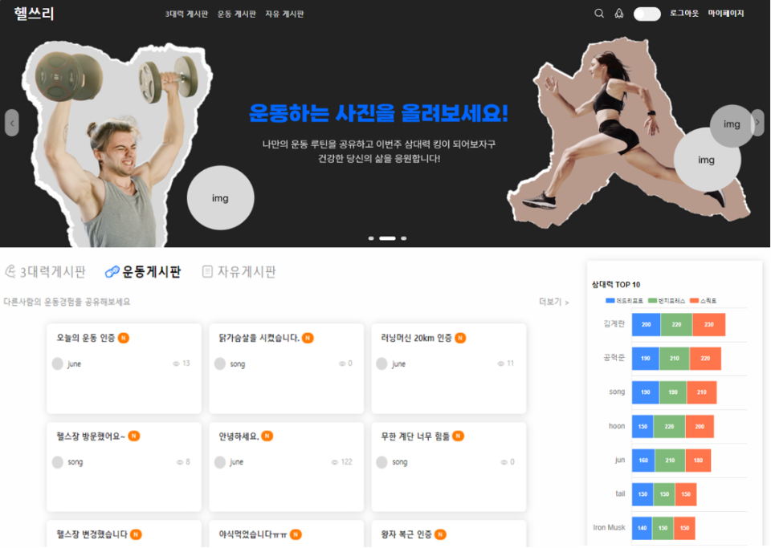

# 📡 헬쓰리

## 💁‍♂️ Introducing Project

> - 이용자에게 3대 운동인 스쿼트, 데드리프트, 벤치프레스 무게 3대 점수를 부여하고 순위를 매기는 것을 주제로한 운동 커뮤니티

## 📅 Date / Developer

> - 개발 기간 : 2022.06.22 ~ (진행 중)
> - 팀 구성 : Frontend(2명), Backend(2명), Designer(1명)

## 🛠 Using Skill

> - React
> - Styled Component
> - Recoil
> - axios
> - Nginx
> - Jenkins
> - Docker

## 🧩 develop

> - 메인화면
> - 회원가입, 로그인, 마이페이지
> - 삼대력게시판
> - 운동게시판
> - 자유게시판
> - 게시글 검색
> - 삼대력 부여
> - 삼대력 순위

## 🌐 배포

> - http://health-community.site/

## 🔧 How To Use?

#### start

```
npm install
npm run start
```

build

```
npm run build
```

## 👓 Screen

<p>운동커뮤니티 헬스리 메인화면</p>
<center>
  
</center>
