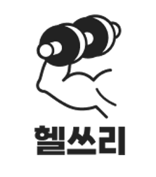
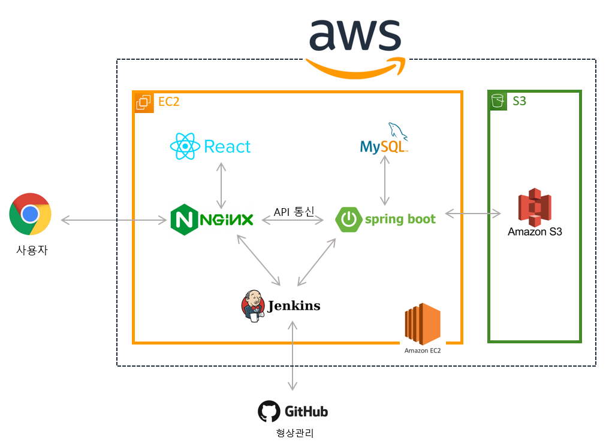
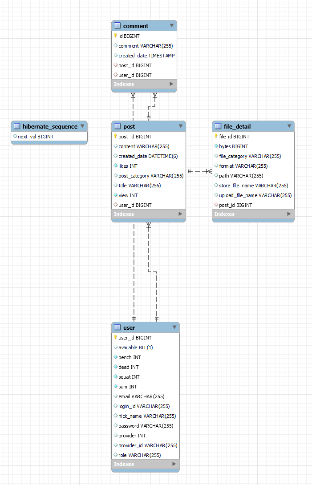

<div align="center">
  <br />
  
  <br />
  <h1>헬쓰리(HealThree)</h1>
  <div>
    
    
  </div>
  <br />
</div>

## 목차

1. [**웹 서비스 소개**](#1)
1. [**버전 기록**](#2)
1. [**기술 스택**](#3)
1. [**주요 기능**](#4)
1. [**프로젝트 구성도**](#5)
1. [**데모 영상**](#6)
1. [**특이사항**](#7)
1. [**구글 애널리틱스 통계**](#8)
1. [**개발 팀 소개**](#9)
1. [**개발 기간 및 일정**](#10)
1. [**실행 방법**](#11)

<br />

<div id="1"></div>

## 💁 웹 서비스 소개

**헬쓰리(HealThree)** 이용자에게 삼대 운동인 스쿼트, 데드리프트, 벤치프레스 무게 3대 점수를 부여하고 순위를 매기는 것을 주제로한 운동 커뮤니티입니다.

삼대력을 통해 커뮤니티 이용자들을 경쟁시켜 운동 효과를 높이고 이용자들끼리 자유로운 소통을 나눕니다.

**💎차별성** : 삼대 동영상을 올린 사용자에게 스쿼트, 데드리프트, 벤치프레스 운동의 무게를 합한 삼대력 점수를 부여합니다.

**💎비지니스** : 운동을 하는 고객층 타겟으로 하여 운동 보조식품, 건강식품 추천 및 광고를 제공하여 수수료 수익 창출

<br />

- '헬쓰리' 게스트 계정 정보

|  아이디  | healthree |
| :------: | :------------------ |
| 비밀번호 | healthree1234!!        |

> 서비스를 구경하고 싶으시다면 상단의 계정 정보로 로그인 후 사용하실 수 있습니다.

<br />


[**🔗 배포된 웹 서비스로 바로가기 Click !**](http://health-community.site) 👈

[**🔗 서비스 소개 영상 바로가기 Click !**](https://#) 👈

[**🔗 프론트엔드 저장소 바로가기 Click !**](https://github.com/HealthCommunity/frontend) 👈

[**🔗 백엔드(메인 서버) 저장소 바로가기 Click !**](https://github.com/HealthCommunity/backend) 👈

[**🔗 프론트엔드 배포서버 저장소 바로가기 Click !**](https://github.com/HealthCommunity/react_build) 👈

> 새 창 열기 방법 : CTRL+click (on Windows and Linux) | CMD+click (on MacOS)

<br />


<div id="3"></div>

## 🛠 기술 스택

### **Front-end**

|  |  |  |  |
| :----------------------------------------------------------------------: | :-------------------------------------------------------------------------: | :-------------------------------------------------------------------------: | :-------------------------------------------------------------------------: |
|                                                               HTML5                                                   |                                                         CSS3                                                    |                                                   Javascript                                              |                                                                                                                                         |

|  |  |  |  |
| :----------------------------------------------------------------------: | :-------------------------------------------------------------------------: | :-------------------------------------------------------------------------: | :-------------------------------------------------------------------------: |
|                                                               React                                                          |                                                         Recoil                                                         |                                                   Styled-Components                                              |                                                                                                                                         |

|  |  | 
| :----------------------------------------------------------------------------------------------------------: | :--------------------------------------------------------------------------------------------------------------------------: | 
|                                                  Apexcharts                                                   |                                                           Tiptap editor                                                            |                                        

### **Back-end**

|  |   |  | 
| :--------------------------------------------------------------------------------------------------------------------------: | :---------------------------------------------------------------------------------------------------------------------------------------------: |   :----------------------------------------------------------------------------------------------------: |
|                                                             Java                                                             |                                                                   Spring-Boot                                                                   |                                                                                                                       MySQL                                                              |                               


|  |  | 
| :--------------------------------------------------------------------------------------------------------------------------------------------------------------------------------------------------: | :-------------------------------------------------------------------------------------------------------------------------: | 
|                                                                                               Postman                                                                                                |                                                           Swagger                                                           |                                                             

### **DevOps**

|  |  |  |  |
| :-------------------------------------------------------------------------------------------------------------------: | :------------------------------------------------------------------------------------------------------------------------------: | :-----------------------------------------------------------------------------------------------------------------------------------------------------------: | :------------------------------------------------------------------------------------------------------------------------------: |
|                                                         NGiNX                                                         |                                                               aws                                                                |                                                                            Jenkins                                                                            |                                                              docker                                                              |

<br />

<div id="4"></div>

## 💡 주요 기능

| 기능                      | 내용                                                                                                                                |
| :------------------------ | :---------------------------------------------------------------------------------------------------------------------------------- |
| 삼대력 측정 & 삼대력 게시판                   | 나의 삼대력은 얼마나 될까? 에 대한 궁금중을 해소하기 위해서 만들어진 기능입니다. <br> 벤치프레스, 스쿼트, 데드리프트의 동영상을 올리면 관리자가 판단해서 3대력을 부여합니다. <br> 해당 3대력의 기록은 홈페이지 메인화면에 순위로 기록되어 다른사람과 기록을 공유할 수 있습니다. <br> 또한 삼대력 게시판의 게시글로 인해 다른사람의 3대력 측정과정의 모든 것을 볼 수 있습니다.|
| 운동 게시판              | 운동게시판은 회원가입이 완료된 사용자가 운동에 대한 정보를 게시글로 남깁니다 <br> 해당 운동게시판은 아래 4가지 큰 틀로 작성됩니다. <br> 1. 식단, 음식 에 대한 정보 <br> 2. 운동기구의 할인정보 <br>3. 헬스장에 대한 정보공유 <br> 4. 운동에 대한 모든 정보 <br><strong>(운동과 관련된 모든 게시글은 운동게시판에 해당됩니다)| 
| 자유 게시판 | 헬쓰리는 커뮤니티입니다. <br> 자유게시판은 그런 회원님들을 위한 틀이 없는 자유로운 공간입니다. <br> 서로 많은 소통을 통해 운동에 대한 사고의 폭을 넓히는 공간이 되면 좋겠습니다.               |
| 검색 기능   | 검색기능은 전체, 게시글작성자, 내용, 제목으로 분류되며 해당내용을 검색해 쉽게 찾을 수 있습니다. <br> 찾고싶은 것이 있으면 바로 사용해보세요!              |
| 반응형 웹 제공            | PC, 테블릿, 모바일 등 어떤 기기에서든 최적화된 헬쓰리를 이용하실 수 있습니다.                                           |
| 슬라이드             | 각 게시판에 있는 슬라이드를 통해 운동하는데 필요한 정보를 얻을 수 있습니다.                           |

<br />

<div id="5"></div>

## 📂 프로젝트 구성도

|                                   아키텍처(Architecture)                                   |
| :----------------------------------------------------------------------------------------: |
|  |

|                              개체-관계 모델(ERD)                               |
| :----------------------------------------------------------------------------: |
|  |

<br />

<div id="6"></div>

## 🎥 데모 영상

[**🔗 서비스 소개 영상 바로가기 Click !**](https://youtu.be/0q4h3c69dXg) 👈

> 새 창 열기 방법 : CTRL+click (on Windows and Linux) | CMD+click (on MacOS)

<br />


<br />

### Headings Map

|                                             홈 페이지                                              |                                                팀 공고 페이지                                                |                                                팀 상세 정보 페이지                                                |
| :------------------------------------------------------------------------------------------------: | :----------------------------------------------------------------------------------------------------------: | :---------------------------------------------------------------------------------------------------------------: |
|  |  |  |

<br />

<div id="9"></div>

## 👪 개발 팀 소개

<table>
  <tr>
    <td align="center" width="150px">
      <a href="https://github.com/pasong0511" target="_blank">
        
      </a>
    </td>
    <td align="center" width="150px">
      <a href="https://github.com/jiji-hoon96" target="_blank">
        
      </a>
    </td>
    <td align="center" width="150px">
      <a href="https://github.com/qkrgnsgml" target="_blank">
        
      </a>
    </td>
    <td align="center" width="150px">
      <a href="https://github.com/changjun6518" target="_blank">
        
      </a>
    </td>
        <td align="center" width="150px">
      <a href="#" target="_blank">
        
      </a>
    </td>
  </tr>
  <tr>
    <td align="center">
      <a href="https://github.com/pasong0511" target="_blank">
        박송희<br />(Front-end & 팀장)
      </a>
    </td>
    <td align="center">
      <a href="https://github.com/jiji-hoon96" target="_blank">
        이지훈<br />(Front-end & 부팀장)
      </a>
    </td>
    <td align="center">
      <a href="https://github.com/qkrgnsgml" target="_blank">
        박훈희<br />(Back-end)
      </a>
    </td>
    <td align="center">
      <a href="https://github.com/changjun6518" target="_blank">
        최창준<br />(Back-end)
      </a>
    </td>
        <td align="center">
        박지민<br />(Desiigner)
      </td>
    </td>
  </tr>
</table>

<br />

<br />

|  이름  |        역할        | <div align="center">개발 내용</div>                                                                                                                                                                                                                                                                                                                                                                                                                                                                                                                                                                                                                                                                                                                                                                                                                                                                                                                                                                                                                                                      |
| :----: | :----------------: | :--------------------------------------------------------------------------------------------------------------------------------------------------------------------------------------------------------------------------------------------------------------------------------------------------------------------------------------------------------------------------------------------------------------------------------------------------------------------------------------------------------------------------------------------------------------------------------------------------------------------------------------------------------------------------------------------------------------------------------------------------------------------------------------------------------------------------------------------------------------------------------------------------------------------------------------------------------------------------------------------------------------------------------------------------------------------------------------- |
| 박훈희 | Back-end<br /> | - '삼대몇' 서비스 기획<br />- DB 설계<br />- Spring Data JPA 세팅<br />- Spring Boot로 RESTful API 작성<br />- 게시판 API 생성<br />&nbsp;&nbsp;&nbsp;&nbsp;- 삼대력 게시글 읽기 · 쓰기 · 수정 · 삭제 API 개발<br />&nbsp;&nbsp;&nbsp;&nbsp;- 운동 게시글 읽기 · 쓰기 · 수정 · 삭제 API 개발<br />&nbsp;&nbsp;&nbsp;&nbsp;- 자유 게시글 읽기 · 쓰기 · 수정 · 삭제 API 개발<br />- 사용자 API 생성<br />&nbsp;&nbsp;&nbsp;&nbsp;- 로그인 API 개발<br />&nbsp;&nbsp;&nbsp;&nbsp;- 회원가입 API 개발<br />&nbsp;&nbsp;&nbsp;&nbsp;- 회원 정보 조회 및 수정 API 개발<br />&nbsp;&nbsp;&nbsp;&nbsp;- 회원 탈퇴 API 개발<br />&nbsp;&nbsp;&nbsp;&nbsp;- 사용자 내 게시글 조회 API 개발- 댓글 API 생성<br />&nbsp;&nbsp;&nbsp;&nbsp;- 댓글 읽기 · 쓰기 ·  수정 · 삭제 API 개발<br />- 기타 API 생성<br />&nbsp;&nbsp;&nbsp;&nbsp;- 검색 결과 API 개발<br />&nbsp;&nbsp;&nbsp;&nbsp;- 3대력 부여 API 개발<br />- EC2, S3 인프라 환경 세팅<br />- 프론트엔드, 백엔드 EC2 배포<br />- Jenkins 활용한 CI/CD<br />- Nginx 웹서버 적용<br />                                                                                                                                                                                                                                                                                                                                                                                                                                                                                                                                                                                                                   |
| 최창준 |      Back-end      | - DB 설계<br />- Spring Boot로 RESTful API 작성<br />&nbsp;&nbsp;&nbsp;&nbsp;- 게시글 썸네일 API 생성<br />- oauth2 구글, 네이버 소셜 로그인 연동<br />- 스프링 시큐리티, 쿠키를 이용한 인증 구현<br />&nbsp;&nbsp;&nbsp;&nbsp;- 회원가입 사용자 인증<br />&nbsp;&nbsp;&nbsp;&nbsp;- 로그인 사용자 인증<br />                                                                                                                                                                                                                                                                                                                                                                       |
| 박송희 |      Front-end & 팀장     | - 회원가입 페이지 서비스 구현<br />- 로그인, 로그아웃 서비스 구현<br />&nbsp;&nbsp;&nbsp;&nbsp;- Recoil을 통한 로그인 상태 전역관리를 통해 로그인 상태 유지<br />- 마이페이지, 회원정보 수정, 탈퇴 구현<br />- 무한 스크롤이 적용된 게시글 목록 컴포넌트를 구현<br />&nbsp;&nbsp;&nbsp;&nbsp;- Intersection Observer를 적용하여 게시글 목록 데이터 호출<br />&nbsp;&nbsp;&nbsp;&nbsp;- 삼대력 동영상 파일 이미지 파일로 변환하여 썸네일 구현<br />- 자체 무한 슬라이드 컴포넌트 기능 개발<br />&nbsp;&nbsp;&nbsp;&nbsp;- 싱글 컨텐츠 슬라이드 메인 슬라이드 적용<br />&nbsp;&nbsp;&nbsp;&nbsp;- 멀티 컨텐츠 슬라이드 게시판 광고 슬라이드 적용<br />- apexcharts 라이브러리를 커스텀<br />&nbsp;&nbsp;&nbsp;&nbsp;- 홈화면 삼대력 Top 10 사용자 차트 적용<br />&nbsp;&nbsp;&nbsp;&nbsp;- 마이페이지 개인 사용자 삼대력 정보 차트 적용<br />- 다크모드 / 라이트모드 기능 구현<br />&nbsp;&nbsp;&nbsp;&nbsp;- Recoil을 통한 상태 적용 및 로컬스토리지 상태 저장<br />- Nginx(Reverse Proxy) 웹서버 적용<br />&nbsp;&nbsp;&nbsp;&nbsp;- docker와 nginx를 이용하여 로컬 작업 환경 Docker Nginx Proxy 서버 설정 <br />&nbsp;&nbsp;&nbsp;&nbsp;- 배포서버 Nginx를 Proxy 서버 설정<br />|
| 이지훈 |     Front-end      | - 삼대력 게시글 생성 · 수정 · 삭제 · 컴포넌트 개발 <br> &nbsp;&nbsp;&nbsp;&nbsp; - Tiptap Editor 커스텀하여 에디터 적용  <br> &nbsp;&nbsp;&nbsp;&nbsp;- Multi-Part-Form을 이용한 게시판 데이터 패칭 기능 구현  <br> - 운동 자유게시판 생성, 수정, 삭제, 컴포넌트 개발  <br>&nbsp;&nbsp;&nbsp;&nbsp; - 댓글 생성 · 수정 · 삭제 컴포넌트 개발  <br> - 삼대력 부여 컴포넌트 및 렌더링 컴포넌트 구현  <br> - 'Media Query'를 이용한 반응형 웹 구현  <br>  - Deskop, tablet , mobile 일때 각각의 Style Form 생성  <br>  - Multi-Part-Form을 이용한 게시판 데이터 패칭 기능 구현  <br> - 네비게이션 / 사이드 네비게이션 개발 <br>     - Media Query 를 이용해 반응형 네비바 구현 <br> - 팀원 소개 페이지 개발 (진행중) <br> - 404 Not Found 페이지 개발  <br> - 게시글 제목, 내용, 작성자 기준으로 검색 기능 구현  <br> - 게시글 관련 에러처리 및 중복코드 함수화  <br> - src 폴더 분류화 |
| 박지민 |     Desiigner      | - '헬스리' 디자인 컨셉 기획<br />- Figma를 활용 반응형 UI / UX <br />&nbsp;&nbsp;&nbsp;&nbsp;- 메인 페이지<br />&nbsp;&nbsp;&nbsp;&nbsp;- 회원가입, 로그인 페이지 페이지<br />&nbsp;&nbsp;&nbsp;&nbsp;- 3대력게시판, 읽기, 쓰기, 댓글 페이지<br />&nbsp;&nbsp;&nbsp;&nbsp;- 운동게시판, 읽기, 쓰기, 댓글 페이지<br />&nbsp;&nbsp;&nbsp;&nbsp;- 네비게이션, 검색 결과 페이지<br />||                                                                                                                       
<br />

<div id="10"></div>

## 📅 개발 기간

22.06.22. ~ 운영 관리 중

<br />

<div id='11'></div>

## 💻 실행 방법

### Client 실행

1. **원격 저장소 복제**

```bash
$ git clone https://github.com/HealthCommunity/frontend.git
```

2. **프로젝트 폴더로 이동**

```bash
$ cd frontend
```

3. **필요한 node_modules 설치**

```bash
$ npm install
```

4. **개발 서버 실행**

```bash
$ npm run start
```

<br />

### Main Server 실행

1. **원격 저장소 복제**

```bash
$ git clone https://github.com/HealthCommunity/backend.git
```

2. **프로젝터 폴더 > src > main > resources 이동**

```bash
$ cd ssafy-mate_back-end
$ cd src
$ cd main
$ cd resources
```

3. **프로젝트 실행을 위한 yml 파일 작성**

- 프로젝트 첫 빌드시 `jpa:hibernate:ddl-auto:create` 로 작성
- 이후에는 `jpa:hibernate:ddl-auto:none` 으로 변경

```bash
server:
  port: [포트번호]

spring:
  redis:
    host: [호스트명]
    port: [포트번호]

  mail:
    host: smtp.gmail.com
    port: 465
    username: [이메일]
    password: [비밀번호]
    smtp:
      socketFactory:
        class: javax.net.ssl.SSLSocketFactory
        fallback: 'false'
        port: '465'
      starttls:
        required: 'true'
        enable: 'true'
      port: '465'
      auth: 'true'

  jpa:
    database-platform: org.hibernate.dialect.MySQL5InnoDBDialect
    hibernate:
      ddl-auto: create
    properties:
      hibernate:
        format_sql: true
        show_sql: true
    defer-datasource-initialization: true

  datasource:
    driver-class-name: com.mysql.cj.jdbc.Driver
    url: [DB설정]
    username: [사용자명]
    password: [비밀번호]

jwt:
  secret: [비밀키]
```

4. **프로젝트 폴더 루트 경로로 이동**

```bash
$ cd ssafy-mate_back-end
```

5. **프로젝트 빌드**

```bash
$ ./gradlew build
```

6. **빌드 폴더 이동 후 war 파일 실행**

```bash
$ cd build
$ java -jar [파일명].war
```

<br />

### Chatting Server 실행

1. **원격 저장소 복제**

```bash
$ git clone https://github.com/ssafy-mate/ssafy-mate_back-end_with-chatting.git
```

2. **프로젝터 폴더 > src > .env 파일 생성**

```bash
DB_USER=[DB 사용자명]
DB_PASSWORD=[DB 비밀번호]
DB_DATABASE=[DB명]
PORT=[포트번호]
```

3. **프로젝터 폴더 > src > ormconfig.ts 파일 생성**

```typescript
import { TypeOrmModuleOptions } from '@nestjs/typeorm';
import * as dotenv from 'dotenv';
import { User } from './src/entities/User';
import { ChattingRoom } from './src/entities/ChattingRoom';
import { ChattingHistory } from './src/entities/ChattingHistory';

dotenv.config();

const config: TypeOrmModuleOptions = {
  type: 'mysql',
  host: '[호스트명]',
  port: 3306,
  username: process.env.DB_USER,
  password: process.env.DB_PASSWORD,
  database: process.env.DB_DATABASE,
  entities: [User, ChattingRoom, ChattingHistory],
  migrations: [__dirname + '/src/migrations/*.ts'],
  cli: { migrationsDir: 'src/migrations' },
  autoLoadEntities: true,
  charset: 'utf8mb4',
  synchronize: false, // ddl-auto 옵션
  logging: true,
  keepConnectionAlive: true,
};

export = config;
```

4. **프로젝터 폴더 > src > output > ormconfig.json 파일 생성**

```json
[
  {
    "name": "default",
    "type": "mysql",
    "host": "[호스트명]",
    "port": 3306,
    "username": "[DB 사용자명]",
    "password": "[DB 비밀번호]",
    "database": "[DB 명]",
    "synchronize": false,
    "entities": ["entities/*.js"]
  }
]
```

5. **프로젝트 폴더 루트 경로로 이동**

```bash
$ cd ssafy-mate_back-end_with-chatting
```

6. **npm 설치**

```bash
$ npm install
```

7. **프로젝트 빌드**

```bash
$ npm run build
```
